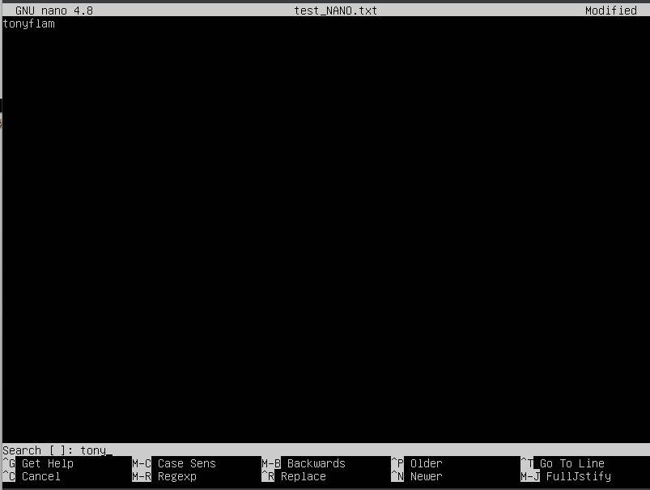
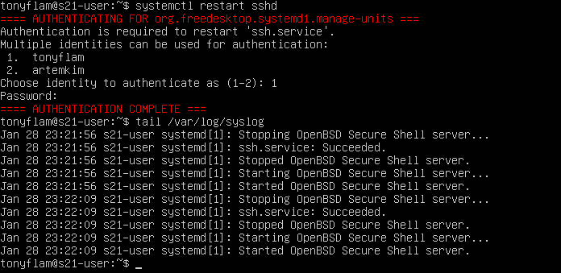

## Part 1. Установка OC
- Выводим версию ubuntu с помощью команды cat/etc/issue
- 
## Part 2. Создание пользователя
- создание нового пользователя через sudo useradd -g имя_группы username
- 
- cat /etc/passwd чтобы показать созданного пользователя
- 
- 
## Part 3. Настройка сети ОС
- создаем имя машины командой sudo hostnamectl set-hostname s21-user
- выводим имя машины cat /etc/hostname
- 
- установка временной зоны sudo timedatectl set-timezone Asia/Tashkent
- проверка временной зоны timedatectl
- 
- вывод названий сетевых интерфейсов ip -br link show
- 
- локальный интерфейс, чтобы подключаться к самой машине - lo
- sudo dhclient -v enp0s3 - чтобы получить IP от DHCP сервера 
-  
- DHCP - Dynamic Host Configuration Protocol - протокол динамической настройки узла
- ip route - проверка адресов шлюзов 
-  
- wget -qO- eth0.me - чтобы посмотреть внешний IP 
- 
- hostname -I - чтобы посмотреть внутренний IP 
- 
- задаем статичные IP, GW, DNS в файле /etc/netplan/00-installer-coinfig.yaml 
- 
- перезагружаемся через команду reboot
- ping ya.ru и 1.1.1.1 убеждаемся, что нет пакет лосса 
- 
## Part 4. Обновление ОС
- обновить пакеты до последних версий
- 
## Part 5. Использование команды sudo
- разрешить юзеру выполнять команду sudo.
- сменить hostname используя sudo.
- 
- sudo - это утилита в Unix-подобных системах, позволяющая пользователю выполнять команды с привилегиями суперпользователя или другого пользователя, если у него есть соответствующие разрешения.
## Part 6. Установка и настройка службы времени
- настройка службы автоматической синхронизации времени
- timedatectl для вывода
- 
## Part 7. Установка и использование текстовых редакторов
- "vim test_vim.txt" > "i" > "tonyflam"  > "Esc" > ":wq"
- 
- "nano" "test_nano.txt" > "tonyflam" > "Ctrl+O" > "Ctrl+X"
- 
- emacs "test_emacs.txt" > "tonyflam" > "C-x C-s" > "C-x C-c"
- 
- Выход без изменений:
- vim ":q!"
- 
- nano "Ctrl+X" > "N"
- 
- emacs "C-x C-c" > "N"
- 
- Поиск
- vim "/строка"
- 
- nano "C-w" > "строка"
- 
- emacs "C-s" > "строка"
- 
- Замена
- vim ":s/" > "подстрока которую меняем" > "подстрока на которую меняем" > "enter"
- 
- nano "C-w C-r" > "подстрока которую меняем" > "enter" > "подстрока на которую меняем" > "enter" > "y"
- 
- emacs "M-x" > "replace-string" > "enter" > "подстрока которую меняем" > "enter" > "подстрока на которую меняем" > "enter"
- 
## Part 8. Установка и базовая настройка сервиса SSHD
- утановка ssh-сервера: sudo apt install openssh-server
- добавление в автозапуск: sudo update-rc.d ssh defaults
- включение службы ssh: sudo systemctl enable ssh
- запуск службы ssh: sudo systemctl start ssh
- изменение порта в ручную: sudo vim /etc/ssh/sshd_config
- смотрим информацию о процессе sshd командой ps -FC sshd. Флаг F выдает подробную информацию, флаг С выдает информацию по дочерним процессам
- перезапускаем службу командой sudo systemctl restart sshd.service
- результат команды netstat -tan:
- 
- флаг t - вывод TCP соединений 
- флаг а - вывод прослушиваемых и непрослушиваемых сокетов
- флаг n - вывод в цифрах адреса, порта и имени пользователей
- Proto выводит протоколы, используемые сокетом
- Recv-Q выводит нескопированные пользовательской программой
байты из сокета
- Send-Q выводит не подтвержденные сокетом байты
- Local Address выводит адрес и номер порта локального сокета 
- Foreign Address выводит адрес и номер порта удаленного сокета
- State выводит состояние сокета
- 0.0.0.0 - неопределенный адрес (любой).
## Part 9. Установка и использование утилит top, htop
- uptime 2.21 
- авторизованных пользователей 1
- общая загрузка системы 0.01, 0.02, 0.00
- общее количество процессов 105
- загрузка CPU 0.00
- загрузка памяти 211.3
- pid процесса, занимающего больше всего памяти 1
- pid процесса, занимающего больше всего процессорного времени 1
- 
- сортировка по pid
- 
- сортировска по Percent_CPU
- 
- сортировска по Percent_MEM
- 
- сортировка по TIME
- 
- фильтр по sshd
- 
- syslog найденный через поиск
- 
- вывод hostname, clock и uptime
- 
## Part 10. Использование утилиты fdisk
- название жесткого диска VBOX-HARDDISK
- размер 25Gib
- секторов 52428800
- 
## Part 11. Использование утилиты df
- 
- размер раздела 11758760
- размер занятого пространста 5259532
- размер свободного пространства 5880120
- 48% использовано
- тип файловой системы ext-4
- 
- размер раздела 12Gb
- размер занятого пространста 5.1Gb
- размер свободного пространства 5.7Gb
- 48% использовано
- тип файловой системы ext-4
## Part 12. Использование утилиты du
- 
Флаги:
- h для вывода в человеческом стиле
- B для вывода в нужном размере, далее размер
- s для вывода именно указанных далее директорий
- all для вывода всех файлов, а не только директорий
- 
## Part 13. Установка и использование утилиты ncdu
- apt install ncdu
- ncdu /home
- 
- ncdu /var
- 
- ncdu /var/log
- 
## Part 14. Работа с системными журналами
- cat /var/log/dmesg
- 
- cat /var/log/syslog
- 
- cat /var/log/auth.log
- Jan 28 23:17:01 s21-user CRON[21438]: pam_unix(cron:session): session opened for user root(uid=0) by (uid=0)
- Время: 28 января 23:17:01
- Имя: root
- Метод: pam_unix
- 
- sudo grep "Accepted" /var/log/auth.log | tail -n 1
- 
- рестарт службы systemctl restart sshd
- 
## Part 15. Использование планировщика заданий CRON
- добавляем исполнение uptime каждые 2 мин
- 
- проверка "crontab -l"
- 
- логи о выполнении cron
- 
- "crontab -r" > "crontab -l" для очистки заданий
